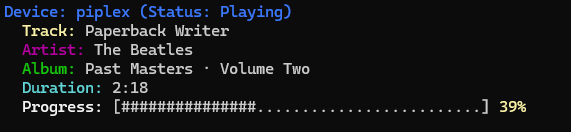

# PlexAmpCliStatus
A small python or c# script to see what's playing on plexamp
"screenshot"

 **Enter Plex Server Details**
   - **Plex Server IP**: Your Plex server's IP address.
   - **Plex Token**: Your Plex server's access token.
     - Find your plex token [here](https://support.plex.tv/articles/204059436-finding-an-authentication-token-x-plex-token/)
